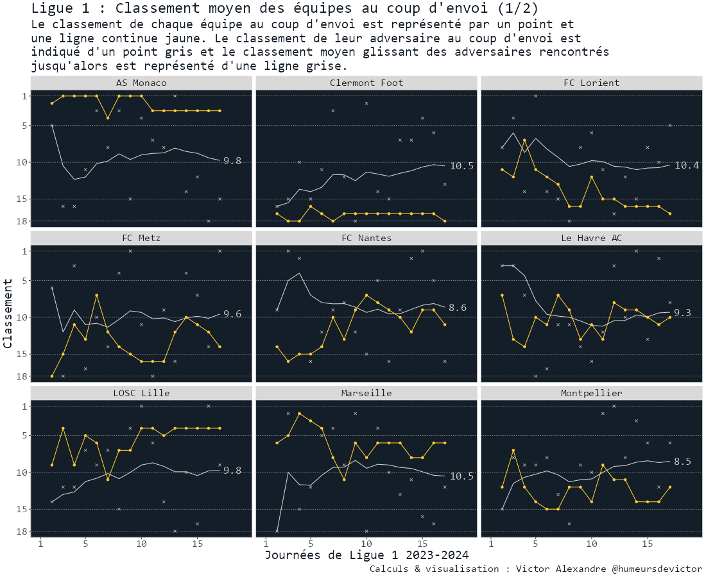
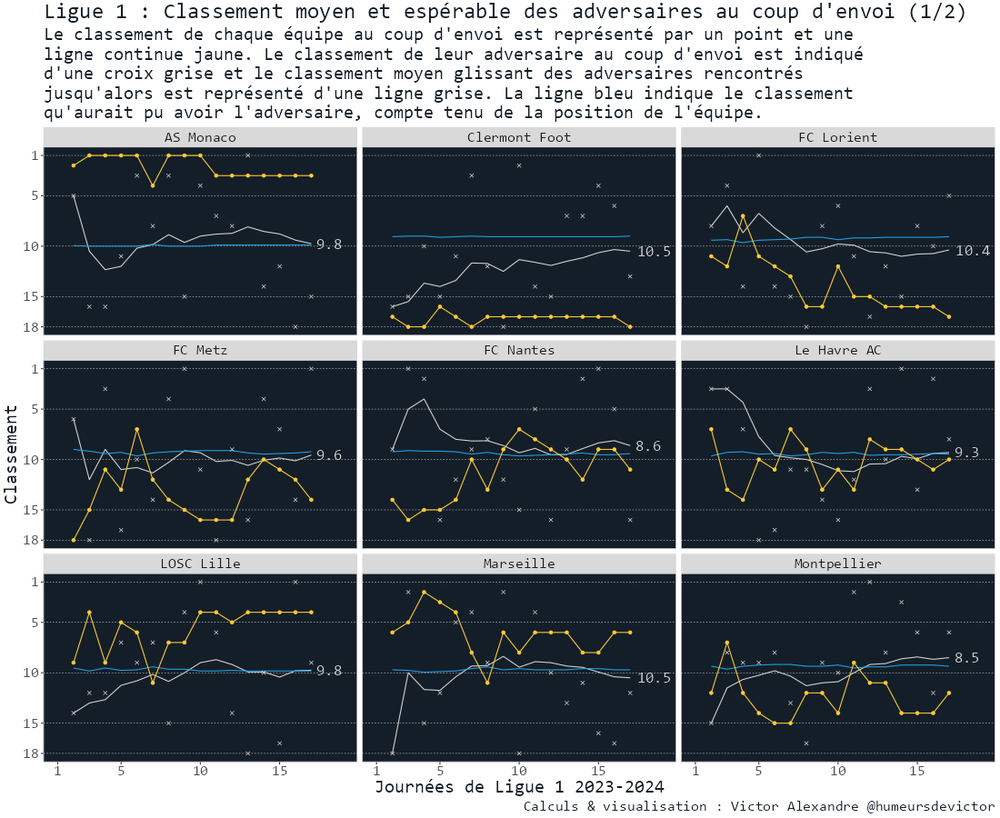
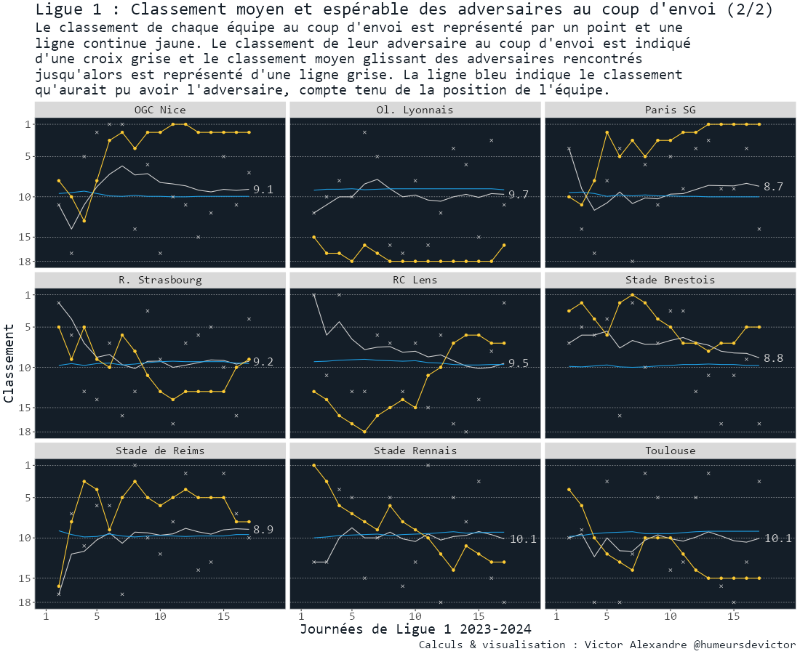

# Ligue 1: statistiques absurdes sur les niveaux des adversaires rencontrés
Une tentative absurde de mesurer le niveau des adversaires rencontrés par les équipes de Ligue 1 en 2023

Je ne suis pas le championnat de Ligue 1 avec une attention forcenée, mais j'ai une petite marotte qui me revient régulièrement : alors que chacune des 18 équipes a rencontré tous ses adversaires, par quelle magie se fait-il qu'elles n'aient pas toutes rencontré au moins une fois le premier, le second... jusqu'au dernier.
Ainsi, logiquement, chaque équipe aurait du jouer au moins 4 matchs contre une équipe classée entre la 1ere et la 5ème place.
Pourtant, certaines n'ont même rencontré que X équipes classés dans le top 5 au coup d'envoi, alors que d'autres ont joué Y fois contre ces grosses équipes.

Imaginons une équipe A qui ne quitterait jamais la première place du championnat et qui rencontrerait une équipe B alors qu'elle est 2nde, une équipe C alors qu'elle est 3e, etc.
Elle aurait rencontré des adversaires avec un classement moyen de (2+3+...+18)/17, soit 10e.
A contrario, une équipe qui n'aurait jamais quitté la dernière place, et aurait rencontré la A en journée 1, la B en journée 2, etc.
Elle aurait rencontré des adversaires avec un classement moyen de (1+2+...+17)/17 soit 9e.
Regardons comment se positionnent nos équipes de Ligue 1 à cette aune-là ?

En fonction de la place qu'on occupe dans le classement, on peut espérer rencontrer un adversaire plus ou moins bien classé. Dans le cas évoqué avant, le 1er peut "espérer" finir la période en ayant rencontré ses 17 adversaires pour un classement moyen espérable de 10. Mais, comme on l'a vu certains vont jouer plus d'équipes alors qu'elles sont bien classées.
Qui s'en tire le mieux à ce jeu là?
Alors qu'ils auraient pu rencontrer des adversaires avec un classement moyen de XX, quelques équipes ont tiré plus souvent qu'à leur tour des équipes bien classées, et d'autres s'en sont mieux tiré.
En jaune, la position de l'équipe concernée, en gris le classement moyen effectif de ses adversaires sur la première partie de saison, et en bleu le classement moyen "espérable".

Si l'on croise la vision classement et cette vision de classement moyen potentiel des adversaires, on peut visualiser comment ces indicateurs ont évolué pour chacune des équipes. Lorsque la courbe grise est au-dessus de la courbe bleu, l'équipe a tiré une équipe mieux classée qu'elle n'aurait pu l'espérer.
Toulouse, par exemple, a rencontré à trois reprises le dernier du championnat sur cette première partie de saison.

Dans cette première partie de saison, et toutes ces explications posées, qui a pris des points dans quelles circonstances ?
Lyon, qui a été longtemps dernier de Ligue 1, a pris l'intégralité de ses points contre des équipes mieux placées qu'elle. Lille et Nice sont également parvenues à réduire l'écart en prenant de nombreux points en face d'équipes mieux classées au coup d'envoi, mais en occupant elles-mêmes plutôt une bonne place.

